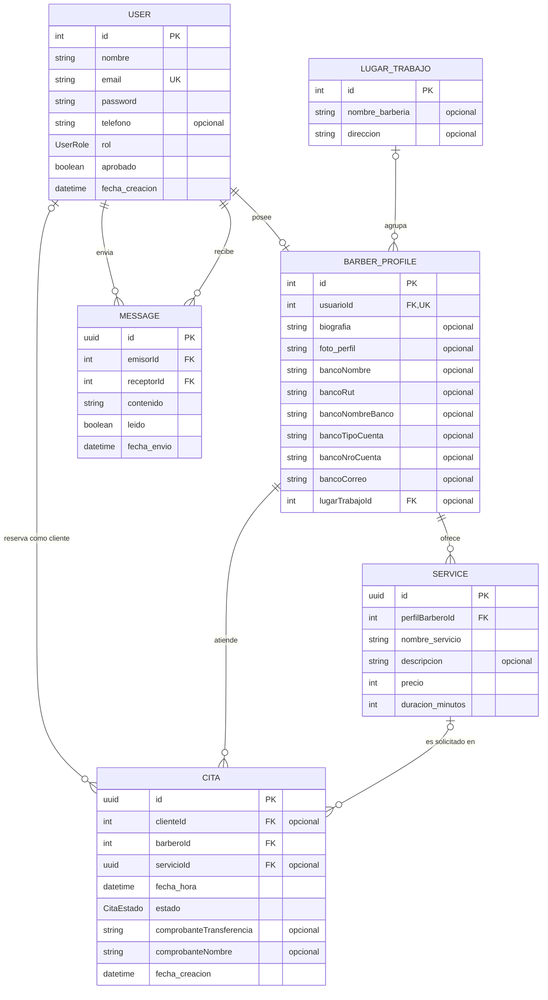

# Modelo Entidad–Relación (MER)

Este diagrama representa el modelo de datos actual definido en `backend/prisma/schema.prisma`.

## Enumeraciones

- `UserRole`: `cliente`, `barbero`, `admin`.
- `CitaEstado`: `disponible`, `pendiente`, `confirmada`, `cancelada`, `finalizada`.

## Reglas principales

- Un usuario puede tener como máximo un perfil de barbero; cada perfil pertenece a un único usuario.
- Un lugar de trabajo puede agrupar varios barberos y un barbero puede no tener lugar de trabajo asignado.
- Un barbero puede ofrecer varios servicios y atender varias citas.
- Una cita siempre tiene un barbero, pero el cliente y el servicio pueden estar temporalmente sin asignar.
- Cada mensaje tiene exactamente un usuario emisor y un usuario receptor.

> `PK`: clave primaria · `FK`: clave foránea · `UK`: clave única.
